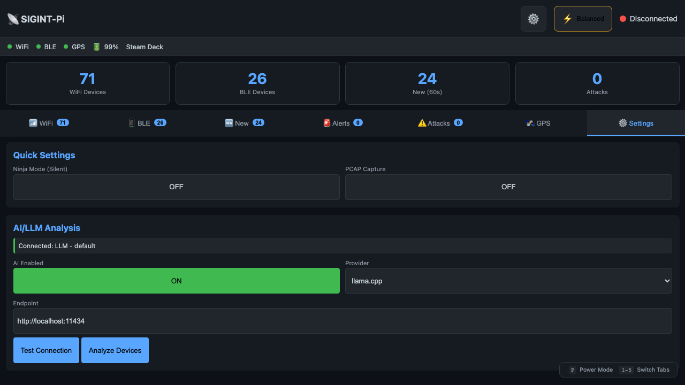

# SIGINT-Pi

Portable signals intelligence and security monitoring for Raspberry Pi.

---

## ⚠️ LEGAL DISCLAIMER AND TERMS OF USE

> **IMPORTANT: BY DOWNLOADING, INSTALLING, OR USING THIS SOFTWARE, YOU AGREE TO THE FOLLOWING TERMS.**

### Research and Entertainment Only

**This software is provided strictly for research, educational, and entertainment purposes only.** It is an experimental tool and is NOT designed, tested, or certified for use in any life-threatening, safety-critical, or emergency situation. Do not rely on this software for personal safety decisions. It may produce false positives, false negatives, inaccurate readings, and erroneous analyses.

### Authorized Use Only

This software is provided **exclusively** for:
- ✅ Authorized security research and penetration testing
- ✅ Educational purposes in controlled environments  
- ✅ Network administration on networks you own or are authorized to monitor
- ✅ Personal security awareness and counter-surveillance of your own property
- ✅ Licensed amateur radio operations
- ✅ TSCM operations by licensed professionals

### Prohibited Uses

You **SHALL NOT** use this software to:
- ❌ Intercept communications without proper legal authorization
- ❌ Track or surveil individuals without their explicit consent
- ❌ Interfere with, jam, or disrupt any radio communications
- ❌ Transmit on frequencies without proper licensing
- ❌ Violate any person's reasonable expectation of privacy
- ❌ Conduct stalking, harassment, or illegal surveillance
- ❌ Intercept cellular, cordless, or similar protected communications

### Complete Assumption of Risk and Release of Liability

**THE AUTHORS AND CONTRIBUTORS OF THIS SOFTWARE SHALL NOT BE LIABLE FOR ANY DIRECT, INDIRECT, INCIDENTAL, SPECIAL, EXEMPLARY, OR CONSEQUENTIAL DAMAGES ARISING FROM YOUR USE OF THIS SOFTWARE.**

By using this software, you **unconditionally and irrevocably**:

1. **Accept full and sole responsibility** for all consequences of your use
2. **Completely absolve** the developer(s), contributor(s), and distributor(s) from any and all claims, damages, and liabilities of every kind
3. **Acknowledge** that if you use this software outside your legal rights or justifications, you bear exclusive responsibility and the developer(s) bear none
4. **Agree to indemnify and hold harmless** the authors from any claims arising from your use

### Regulatory Compliance

This software interacts with radio frequency spectrum and wireless communications, subject to strict regulation by the FCC (47 CFR), ECPA (18 U.S.C. § 2511), CFAA (18 U.S.C. § 1030), and equivalent international regulatory bodies. **You are solely responsible for legal compliance in your jurisdiction.**

### Acceptance

**By downloading, installing, or using this software, you certify that:**
1. You have read and understood the full [LEGAL.md](LEGAL.md) document
2. You will use this software only for lawful, authorized purposes
3. You accept this is research/entertainment software, not a safety device
4. You accept all risks and absolve the developers of all liability

**If you do not agree to these terms, do not download, install, or use this software.**

---

## Screenshots


*WiFi monitoring with device detection, channel info, and signal strength*


*Bluetooth/BLE scanning with tracker detection (AirTag, Tile, etc.)*


*Settings panel with AI/LLM integration and quick toggles*

> **LEGAL DISCLAIMER**: This tool is for authorized security research and educational purposes only. Monitoring wireless communications without authorization may be illegal in your jurisdiction. You are solely responsible for ensuring your use complies with all applicable laws.

## Features

- **WiFi Monitoring** (802.11)
  - Device detection and tracking (56+ devices in testing)
  - Probe request analysis and MAC randomization fingerprinting
  - Signal strength monitoring (RSSI)
  - Attack detection (deauth, evil twin, KARMA)
  - DJI DroneID and ASTM F3411 RemoteID WiFi frame parsing
  - PCAP capture for forensics
  - Auto monitor mode recovery via systemd

- **Bluetooth/BLE Monitoring**
  - BLE advertisement scanning
  - AirTag/Tile/SmartTag tracker detection with extended data
  - Device type classification (Phone, Wearable, SmartLight, etc.)
  - Lost mode and separated device detection

- **SDR Spectrum Analysis**
  - RTL-SDR, HackRF One, LimeSDR, KrakenSDR support
  - Spectrum analyzer with band presets
  - TSCM sweep (counter-surveillance) with threat database and auto-scroll
  - Continuous drone RF monitoring (military + commercial bands)
  - RTL-433 ISM band device decoding
  - Cell tower scanning via kalibrate-rtl
  - Browser audio streaming (FM/AM/SSB)
  - Distance estimation via free-space path loss model

- **IMSI Catcher Detection** (RayHunter)
  - EFF RayHunter integration via direct HTTP API
  - Automatic ADB port forwarding
  - Real-time monitoring with audible alerts
  - QMDL recording start/stop control

- **Drone Detection** (ML-Enhanced)
  - RF signature detection for military drones (9 countries)
  - EMI harmonic analysis with ML-enhanced FFT (Rust `rustfft`)
  - Spectral feature extraction (centroid, bandwidth, flatness, rolloff, peak-to-avg)
  - Online anomaly baseline learning (Welford's algorithm, flags novel signatures)
  - ML modulation classification (FHSS, OFDM, Burst/TDMA, Narrowband)
  - DJI product_type byte mapping (32 known models)
  - Controller SSID to drone model mapping (RC400L, RC230, RC-N1, etc.)
  - Combined RF+EMI correlation for high confidence
  - ONNX Runtime inference ready (behind `--features ml` flag)
  - Continuous scanning with contact tracking

- **Soundboard**
  - 40 procedural alert clips (drone, tracker, IMSI, TSCM, geofence, FRS channel IDs, CTCSS tones)
  - Web UI with clip grid, upload, browser playback, device playback (aplay)
  - RF transmit via HackRF+csdr pipeline with safety interlocks
  - TX frequency blocklist (cellular, aviation, emergency bands)
  - Interactive audio console with volume control and SDR monitor
  - Scraper script generates all clips via sox

- **Commercial RF Monitor** (130-band database)
  - US fast food: McDonald's, Burger King, Wendy's, Taco Bell, KFC, Chick-fil-A, Hardee's, White Castle
  - Intercom vendors: HME (legacy + NEXEO DECT), PAX/3M, TELEX/Bosch, Delphi
  - EU: PMR446 ch 1-8, DECT 1880-1900, ISM 868 MHz
  - UK: Ofcom Simple Site Licence, Business Radio 453-454
  - Japan: Tokutei 421-422, ARIB 900 MHz
  - Australia: UHF CB 476-477, ISM 915-928
  - Restaurant pagers: LRS POCSAG, Jtech, Revel
  - FRS (22 channels) + MURS (5 channels) + GMRS
  - Security companies: G4S/Wackenhut/Allied Universal, Securitas, Star/Dot itinerant freqs
  - Area 51/NTTR: 24 frequencies (Dreamland MOA, Groom Lake, Cammo Dudes, Skunkworks, AWACS)
  - Business band Color Dot/Star frequencies
  - Tune-to-listen button on every frequency
  - Company dropdown filter (worldwide)
  - User-saved monitor presets (localStorage)

- **AI/LLM Integration** (Optional)
  - Device analysis via local or cloud LLM
  - Support for llama.cpp, Ollama, LMStudio, OpenAI
  - Threat intelligence with 100+ surveillance equipment OUIs

- **ML Infrastructure**
  - Rust FFT via `rustfft` (no Python dependency for real-time analysis)
  - Spectral feature extraction: 11 features per signal
  - Harmonic series detection with tolerance bins
  - Autoencoder anomaly detector with online baseline learning
  - ONNX Runtime classifier ready for trained models (IQ modulation, ESC type, device fingerprint)
  - `/api/ml/status`, `/api/ml/classify`, `/api/ml/features` endpoints

- **GPS Integration**
  - Location tracking with USB GPS
  - Geofencing with alerts

- **Device Learning & Anomaly Detection**
  - Learns baseline of normal devices over time
  - Flags new/unknown devices immediately
  - Detects anomalous behavior patterns
  - Device fingerprinting (survives MAC randomization)
  - Configurable training period (default: 1 hour)

- **Browser-Based Headless Audio**
  - Browser Sound Alerts: distinct tones per alert type (drone, tracker, IMSI siren, critical, high)
  - Browser TTS: speaks alert text via Piper WAV or Web Speech API fallback
  - Both persist across reloads (localStorage)
  - No Pi speakers/HDMI needed -- works from any browser on the network

- **Multi-Channel Alerts**
  - Sound alerts with Ninja Mode
  - Browser sound tones + TTS (headless)
  - Telegram, Signal, Email, MQTT
  - Custom webhooks

- **SIEM Event Log**
  - SQLite-backed event log with severity levels
  - Configurable retention and pruning
  - Search, export, and forward to external SIEM

## Hardware Requirements

> **IMPORTANT**: Steam Deck's internal WiFi does NOT support monitor mode!

| Component | Recommendation | Notes |
|-----------|---------------|-------|
| Steam Deck | LCD or OLED | Main platform |
| USB WiFi | Alfa AWUS036ACHM | Monitor mode required |
| USB GPS | VK-162 u-blox 7 | Optional |
| USB Hub | Powered | Recommended |

### Optional SDR Hardware

SIGINT-Deck supports Software Defined Radio for advanced spectrum monitoring:

| SDR Device | USB ID | Frequency Range | Notes |
|------------|--------|-----------------|-------|
| RTL-SDR (RTL2832U) | 0bda:2838 | 24-1766 MHz | Budget option, RX only |
| HackRF One | 1d50:6089 | 1-6000 MHz | TX/RX capable |
| LimeSDR Mini | 0403:601f | 10-3500 MHz | Full duplex, high bandwidth |
| LimeSDR USB | 1d50:6108 | 100kHz-3.8GHz | Professional grade |

### Optional IMSI Catcher Detection

| Component | Recommendation | Notes |
|-----------|---------------|-------|
| RayHunter Device | Pixel 3a/4a with RayHunter | EFF's IMSI catcher detector |
| USB Cable | Data-capable USB-C | Connect phone to Steam Deck |

## Quick Start

### 1. Enable Developer Mode

```bash
# On Steam Deck, switch to Desktop Mode
# Settings → System → Enable Developer Mode
# Open Konsole and set password:
passwd
```

### 2. Clone and Setup

```bash
git clone https://github.com/naanprofit/sigint-deck.git
cd sigint-deck

# Run setup script
chmod +x steamdeck/setup-steamdeck.sh
./steamdeck/setup-steamdeck.sh
```

### 3. Configure

```bash
cp config.toml.example ~/sigint-deck/config.toml
nano ~/sigint-deck/config.toml
```

Key settings:
- `wifi.interface` - External WiFi adapter (usually `wlan1`)
- `gps.enabled` - Enable if GPS connected
- `alerts.*` - Configure notification channels

### 4. Start

```bash
~/sigint-deck/start-sigint.sh
```

Dashboard: http://localhost:8080

## WiFi Interface Setup

The setup script ensures persistent naming:
- `wlan0` = Internal Steam Deck WiFi (managed)
- `wlan1` = External USB WiFi (monitor mode)

## Web Dashboard

Features:
- Real-time device lists (WiFi + BLE)
- **New Devices** tab - combined view of devices seen in last 60 seconds
- Tracker detection with status badges
- Attack alerts
- GPS location
- Settings management

### Keyboard Shortcuts

| Key | Action |
|-----|--------|
| 1 | WiFi tab |
| 2 | BLE tab |
| 3 | New devices |
| 4 | Alerts |
| 5 | Attacks |
| 6 | SDR / Radio |
| 7 | TSCM |
| 8 | IMSI / RayHunter |
| N | Toggle Ninja Mode |

## PCAP Capture

```bash
# Start capture via API
curl -X POST http://localhost:8080/api/pcap/start

# Check status
curl http://localhost:8080/api/pcap/status

# Stop capture
curl -X POST http://localhost:8080/api/pcap/stop

# List capture files
curl http://localhost:8080/api/pcap/files
```

## Geofencing

```bash
# Set home location
curl -X POST http://localhost:8080/api/geofence/home \
  -H "Content-Type: application/json" \
  -d '{"latitude": 40.7128, "longitude": -74.0060, "radius_m": 100}'

# Check status
curl http://localhost:8080/api/geofence/status
```

## Settings

Settings are saved to `~/sigint-deck/config.toml`:

```bash
# Save settings via API
curl -X POST http://localhost:8080/api/settings \
  -H "Content-Type: application/json" \
  -d @settings.json
```

## Systemd Service

```bash
# Start
systemctl --user start sigint-deck

# Stop  
systemctl --user stop sigint-deck

# Enable on boot
systemctl --user enable sigint-deck
loginctl enable-linger deck

# Logs
journalctl --user -u sigint-deck -f
```

## API Endpoints

| Endpoint | Method | Description |
|----------|--------|-------------|
| `/api/status` | GET | System status |
| `/api/wifi/devices` | GET | WiFi devices |
| `/api/ble/devices` | GET | BLE devices |
| `/api/alerts` | GET | Recent alerts |
| `/api/settings` | GET/POST | Settings |
| `/api/pcap/start` | POST | Start PCAP |
| `/api/pcap/stop` | POST | Stop PCAP |
| `/api/geofence/home` | POST | Set geofence |
| `/api/sdr/status` | GET | SDR hardware detection |
| `/api/sdr/spectrum` | POST | Spectrum scan |
| `/api/sdr/radio/tune` | POST | Tune radio |
| `/api/sdr/radio/stream` | GET | PCM audio stream |
| `/api/sdr/tscm/sweep` | POST | TSCM sweep |
| `/api/sdr/drone/scan` | POST | Drone RF scan |
| `/api/sdr/rtl433/devices` | GET | RTL-433 decoded devices |
| `/api/rayhunter/status` | GET | RayHunter IMSI status |
| `/api/rayhunter/start-recording` | POST | Start QMDL recording |
| `/api/rayhunter/stop-recording` | POST | Stop QMDL recording |

## OUI Database

Includes 500+ vendor entries:
- Consumer devices (Apple, Samsung, Intel, etc.)
- IoT/Smart Home (MELK LED strips, Govee, Philips Hue, etc.)
- Threat intel (Harris/Stingray, Hikvision, Dahua, etc.)

## Device Learning

SIGINT-Deck learns your environment over time:

### Training Period
```toml
[learning]
enabled = true
training_hours = 1    # Hours to establish baseline
anomaly_threshold = 0.7
```

### What Happens
1. **During Training**: Collects device data, no anomaly alerts
2. **After Training**: Known devices become baseline, new devices flagged
3. **Location Change**: GPS detects movement > 100m, resets training

### Anomaly Detection
After training, devices are scored for unusual behavior:
- Signal strength deviation
- Unusual time of appearance  
- Behavioral pattern changes

Score > 0.7 triggers alert.

### Device Fingerprinting
Creates behavioral profiles that survive MAC randomization:
- Probe request patterns
- Time-of-day patterns
- Associated networks
- Device classification (Phone, Laptop, IoT, etc.)

## Troubleshooting

### WiFi adapter not in monitor mode
```bash
sudo ip link set wlan1 down
sudo iw wlan1 set type monitor
sudo ip link set wlan1 up
```

### GPS not detecting
```bash
# Check device
lsusb | grep -i u-blox
ls -la /dev/ttyACM*

# Start gpsd
sudo gpsd /dev/ttyACM0 -F /var/run/gpsd.sock
```

### Dashboard shows disconnected
```bash
# Check service
systemctl --user status sigint-deck

# Check API
curl http://localhost:8080/api/status
```

## SDR Support (Optional)

SIGINT-Deck supports Software Defined Radios for spectrum monitoring. Since Steam Deck has a read-only root filesystem, SDR tools are installed to `~/bin` to survive SteamOS updates.

### Install SDR Tools

```bash
# Run the SDR setup script
~/sigint-deck/scripts/install-sdr.sh
```

Or install manually:

```bash
# The script downloads and extracts SDR tools from Arch packages
mkdir -p ~/sdr-tools ~/bin/lib

# RTL-SDR
wget "https://archive.archlinux.org/packages/r/rtl-sdr/rtl-sdr-1%3A2.0.2-1-x86_64.pkg.tar.zst" -O rtl-sdr.pkg.tar.zst
zstd -d rtl-sdr.pkg.tar.zst && tar xf rtl-sdr.pkg.tar
cp usr/bin/rtl_* ~/bin/ && cp usr/lib/*.so* ~/bin/lib/

# HackRF
wget "https://archive.archlinux.org/packages/h/hackrf/hackrf-2024.02.1-3-x86_64.pkg.tar.zst" -O hackrf.pkg.tar.zst
zstd -d hackrf.pkg.tar.zst && tar xf hackrf.pkg.tar
cp usr/bin/hackrf_* ~/bin/ && cp usr/lib/*.so* ~/bin/lib/

# LimeSDR
wget "https://archive.archlinux.org/packages/l/limesuite/limesuite-23.11.0-4-x86_64.pkg.tar.zst" -O limesuite.pkg.tar.zst
zstd -d limesuite.pkg.tar.zst && tar xf limesuite.pkg.tar
cp usr/bin/Lime* ~/bin/ && cp usr/lib/*.so* ~/bin/lib/

# Add to .bashrc
echo 'export LD_LIBRARY_PATH="$HOME/bin/lib:$LD_LIBRARY_PATH"' >> ~/.bashrc
```

### SDR Tools Reference

| Tool | Purpose | Example |
|------|---------|---------|
| `rtl_sdr` | Raw I/Q capture | `rtl_sdr -f 433.92M -s 2.4M capture.bin` |
| `rtl_fm` | FM demodulation | `rtl_fm -f 99.5M -M wbfm -s 200k - \| aplay -r 48000` |
| `rtl_power` | Spectrum scanning | `rtl_power -f 400M:500M:100k -i 1 scan.csv` |
| `rtl_adsb` | Aircraft tracking | `rtl_adsb` |
| `hackrf_info` | HackRF device info | `hackrf_info` |
| `hackrf_sweep` | Wideband sweep | `hackrf_sweep -f 2400:2500 -w 100000` |
| `hackrf_transfer` | Raw TX/RX | `hackrf_transfer -r capture.bin -f 433920000` |
| `LimeUtil` | LimeSDR info | `LimeUtil --find` |
| `SoapySDRUtil` | Universal SDR API | `SoapySDRUtil --find` |

### Verify Installation

```bash
export LD_LIBRARY_PATH="$HOME/bin/lib:$LD_LIBRARY_PATH"

# Test RTL-SDR
rtl_test -t

# Test HackRF
hackrf_info

# Test LimeSDR
LimeUtil --find

# Universal check
SoapySDRUtil --find
```

## RayHunter IMSI Catcher Detection (Optional)

SIGINT-Deck integrates with EFF's RayHunter for detecting IMSI catchers (Stingrays).

### Requirements

- Pixel 3a, 3a XL, 4a, or 4a 5G with RayHunter installed
- USB data cable

### Setup

```bash
# Install ADB (Android Debug Bridge)
~/sigint-deck/scripts/install-adb.sh

# Connect phone and enable USB debugging
adb devices  # Should show your device

# Enable and start RayHunter ADB service
systemctl --user enable --now rayhunter-adb
```

### How It Works

1. RayHunter runs on the Pixel phone, monitoring cellular baseband
2. SIGINT-Deck polls RayHunter via ADB every 5 seconds
3. If IMSI catcher activity detected, a distinct siren alert plays
4. The "🐳 IMSI" tab shows real-time status

### RayHunter Analyzers

| Analyzer | Detection |
|----------|-----------|
| IMSI Identity Request | Cell tower requesting your IMSI |
| 2G Downgrade | Forced downgrade to insecure 2G |
| LTE SIB 6/7 Downgrade | Suspicious broadcast of 2G/3G priorities |

## Documentation

| Document | Description |
|----------|-------------|
| [INSTALL.md](docs/INSTALL.md) | Full installation guide for Pi and Deck |
| [BUILD.md](docs/BUILD.md) | Build from source (native and cross-compile) |
| [KNOWN_ISSUES.md](KNOWN_ISSUES.md) | Known bugs, workarounds, and hardware quirks |
| [CHANGELOG.md](CHANGELOG.md) | Version history and all fixes |
| [LEGAL.md](LEGAL.md) | Legal compliance and regulatory guidance |
| [CREDITS.md](CREDITS.md) | Open-source credits and attributions |
| [DRONE_DETECTION.md](docs/DRONE_DETECTION.md) | Drone detection methodology and frequencies |
| [TSCM-THREAT-DATABASE.md](docs/TSCM-THREAT-DATABASE.md) | TSCM threat signatures |
| [HARDWARE-BOM.md](docs/HARDWARE-BOM.md) | Bill of materials |
| [PI_REQUIREMENTS.md](docs/PI_REQUIREMENTS.md) | Pi hardware requirements |

## Legal Notice

This software is for **authorized security research only**.

- Only use on networks/devices you own or have permission to monitor
- Unauthorized interception is illegal in most jurisdictions
- You are solely responsible for legal compliance
- See [LEGAL.md](LEGAL.md) for complete regulatory guidance

## Support

If you find SIGINT-Deck useful, consider supporting development:

**Bitcoin:** `3GD3hpufcCPCemfQdoAFu9JH5Td5US1pzJ`

## License

GPL-3.0-or-later. See [LICENSE](LICENSE) for full text.

## Repository

https://github.com/naanprofit/sigint-pi

> This is the Raspberry Pi build of the SIGINT-Deck project. The codebase is identical to [sigint-deck](https://github.com/naanprofit/sigint-deck) with Pi-specific defaults. Both repos produce the same binary.
